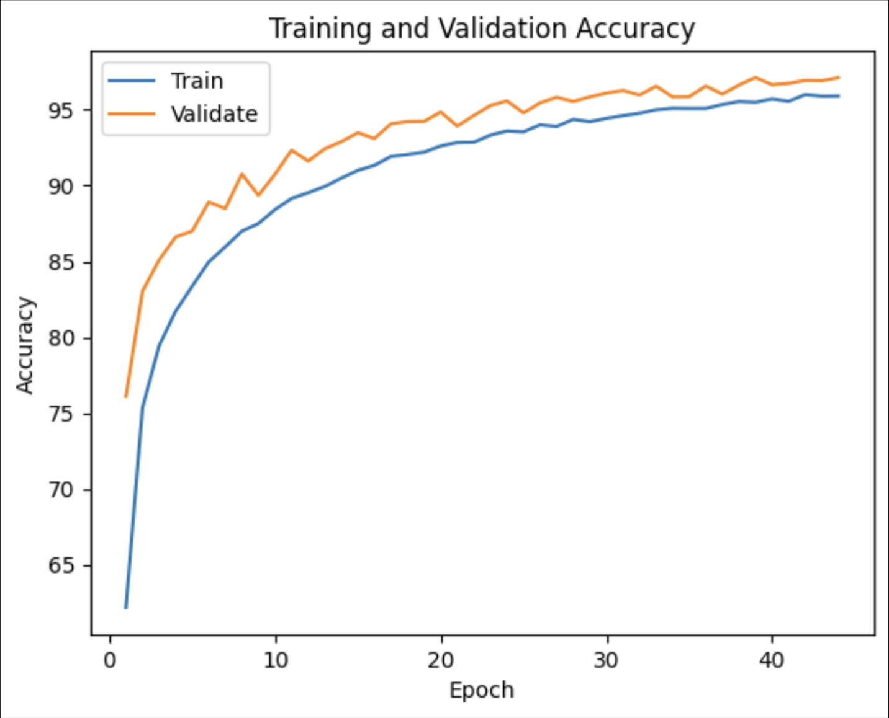
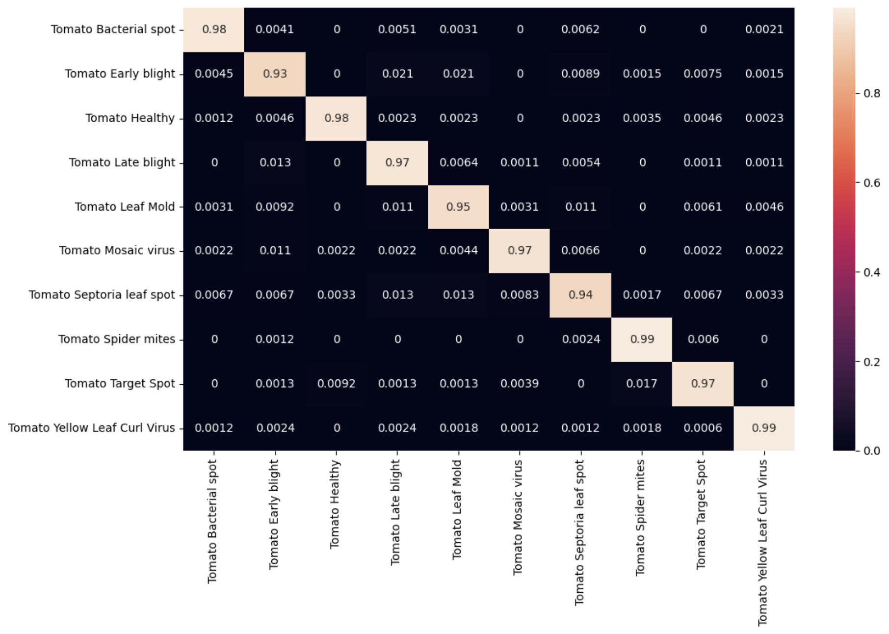

# Plant Disease Classification using Convolutional Neural Networks

**Type:** Academic Machine Learning Project  
**Course:** ECS 170 – Introduction to Artificial Intelligence (UC Davis)

---

## Overview

This project implements an **end-to-end deep learning pipeline** for classifying tomato plant leaf diseases from images using a **Convolutional Neural Network (CNN)**. The system automatically distinguishes between healthy leaves and multiple disease categories, enabling scalable plant disease detection for agricultural and home-gardening use cases.

The project emphasizes **data preprocessing, architectural tradeoffs, evaluation metrics, and error analysis**, reflecting real-world machine learning workflows rather than a black-box approach.

---

## Problem Statement

Manual plant disease detection requires expert knowledge and careful visual inspection, making it time-consuming and error-prone. This project explores whether a **lightweight CNN** can accurately classify tomato leaf diseases from images while maintaining efficiency and generalization.

---

## Dataset

Tomato leaf images were combined from two public Kaggle datasets:

- **PlantDisease Dataset** (emmarex/plantdisease)
- **PlantifyDR Dataset** (lavaman151/plantifydr-dataset)

Only tomato-related classes were extracted to form a **10-class dataset**, including healthy leaves and multiple disease categories. Using multiple data sources increased variation in lighting conditions, backgrounds, and image quality, improving generalization.

> **Note:** Due to dataset size, raw images are not included in this repository. Users must download the datasets manually and place them in the `data/` directory before running preprocessing.

---

## Model Architecture

The final model is a **custom CNN optimized for grayscale images**, focusing on texture and shape features rather than color.

### Architecture Summary
- **Input:** 1-channel grayscale image  
- **Convolutional Layers:**  
  - 16 → 32 → 64 feature maps  
  - ReLU activation + 2×2 max pooling  
- **Fully Connected Layer:** 128 units  
- **Output Layer:** 10 disease classes  

> Grayscale preprocessing reduced model complexity and training cost while outperforming RGB-based models in validation accuracy.

---

## Training Setup

- **Loss Function:** CrossEntropyLoss  
- **Optimizer:** Adam (learning rate = 0.001)  
- **Batch Size:** 64  
- **Epochs:** 50  
- **Hardware:** NVIDIA A100 GPUs with mixed-precision training (CUDA)  

> Although training was performed on A100 GPUs, the model is lightweight and can be trained on consumer GPUs with longer runtimes.

---

## Results

### Final Model Performance

| Metric | Value |
|------|------|
| **Test Accuracy** | **97%** |
| Validation Accuracy | 97.12% |
| Training Accuracy | 95.90% |
| Number of Classes | 10 |



The model achieved **high precision, recall, and F1-scores across all disease categories**, with particularly strong performance in identifying healthy plants.

All figures, plots, and visualizations (including confusion matrices) can be found in `CNN_Program.ipynb`.

---

## Evaluation & Error Analysis

Evaluation metrics included:
- Accuracy
- Confusion matrix
- Precision / Recall / F1-score

### Confusion Matrix


### Key Findings
- Misclassifications often occurred due to **high-contrast lighting**, **cluttered backgrounds**, or **poor image quality**.
- Increasing model depth beyond the final architecture led to **decreased performance**, highlighting the importance of controlled model complexity.
- Grayscale preprocessing consistently outperformed RGB inputs in both accuracy and training stability.

---

## Key Experiments & Learnings

- Grayscale images improved generalization compared to RGB.
- Lightweight CNNs can achieve strong performance when paired with careful data preparation.
- Dataset quality and class balance significantly impact classification precision.
- Error analysis is critical for understanding real-world model limitations.

---

## How to Run

### 1. Clone the repository
```bash
git clone https://github.com/j22038/ecs-170.git
cd ecs-170
```

### 2. Run Image Preprocessing
Open and run:

`image_preprocessing.ipynb`

### 3. Train and Evaluate the Model
Open and run:

`CNN_Program.ipynb`

---

## Project Structure

```text
ecs-170/
├── data/                      # Dataset directory
├── image_preprocessing.ipynb  # Data preprocessing and augmentation
├── CNN_Program.ipynb          # CNN training and evaluation
└── README.md
```
---

## References
- https://stackoverflow.com/questions/57394135/split-image-dataset-into-train-test-datasets
- https://medium.com/@myringoleMLGOD/simple-convolutional-neural-network-cnn-for-dummies-in-pytorch-a-step-by-step-guide-6f4109f6df80
- https://medium.com/@kritiikaaa/convolution-neural-networks-guide-for-your-first-cnn-project-7ea56f7f6960
- https://www.geeksforgeeks.org/deep-learning/how-to-handle-overfitting-in-pytorch-models-using-early-stopping/
- https://www.geeksforgeeks.org/deep-learning/hyperparameter-tuning-with-optuna-in-pytorch/
- https://christianbernecker.medium.com/how-to-create-a-confusion-matrix-in-pytorch-38d06a7f04b7

---

## Presentation Slides
https://docs.google.com/presentation/d/1n8NIl6BphJya9H3Kyz8YRvxcctLjRN6u9nb7_GsFg_E/edit?usp=sharing